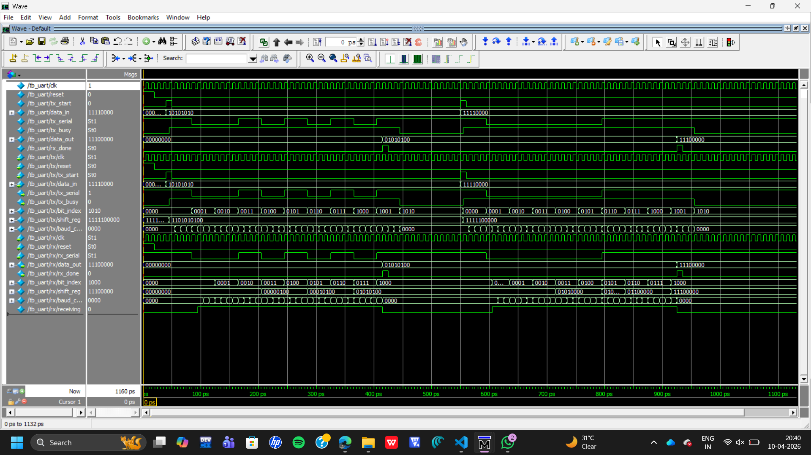

# UART Transmitter & Receiver (Verilog)

## 📌 Overview
This project implements a Universal Asynchronous Receiver Transmitter (UART) using Verilog HDL. It includes both transmitter (TX) and receiver (RX) modules to demonstrate asynchronous serial communication.

---

## 🚀 Features
- UART Transmitter (TX)
- UART Receiver (RX)
- Baud rate control using counter
- Mid-bit sampling in receiver
- Asynchronous serial communication
- Verified using ModelSim simulation

---

## ⚙️ Design Details

### 🔹 Transmitter (TX)
- Adds start bit (0) and stop bit (1)
- Sends 8-bit data serially (LSB first)
- Controlled using baud rate divider

### 🔹 Receiver (RX)
- Detects start bit
- Samples data at the middle of each bit
- Reconstructs 8-bit parallel data
- Generates `rx_done` signal after complete reception

---

## 🧪 Simulation

- Tool Used: ModelSim
- Testbench: `tb_uart.v`

### Test Cases:
1. `10101010`
2. `11110000`

---

## 📊 Output Waveform



---

## ▶️ How to Run
```
vlib work
vmap work work
vlog uart_tx.v
vlog uart_rx.v
vlog tb_uart.v
vsim tb_uart
run 1000
```

---

## 💡 Applications
- Serial communication systems
- Embedded systems
- FPGA/ASIC design
- Communication interfaces

---

## 🛠️ Tools & Technologies
- Verilog HDL
- ModelSim
- Digital Design Concepts

---

## 👩‍💻 Author
SATHVIKA BOGAM
